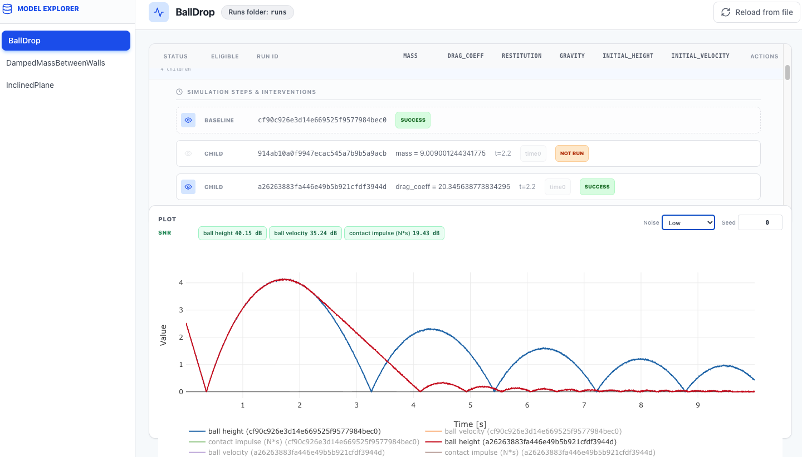

# $\mathrm{TSEnv}$: Controllable Time Series Exploration Benchmark for Agents

## Benchmark dataset

The dataset can be found on [Kaggle](https://kaggle.com/datasets/2c83978c7688bf83670612cb6fb5ac23e6c2bfb0243daae862f5b305e58780e0). It contains data built from Simulink-generated time-series trajectories. Each trajectory corresponds to one materialized Simulink run: either a simulation with no intervention, or a simulation with one exact physical parameter changing once in the the simulation interval. Each environment-specific directory, for example `tsENV_questions/BallDrop/`, contains:

```text
questions.json          # Question prompts, label space, metadata, and ground-truth references
sample_manifest.json    # Train/test selections for each shot setting and seed
dataframes/             # Exported time-series trajectories as Parquet files
model_record.json       # Runtime metadata for the exported runs
noise_adder.py          # Optional model-specific noise utility
```

## Prerequisites

### Python environment

This project requires Python 3.12 with the packages listed in `requirements.txt`. Create and activate a conda environment:

```bash
conda create -n tsenv python=3.12
conda activate tsenv
pip install -r requirements.txt
```

The benchmark runner expects a Python executable at `env/bin/python`. Create a symlink to your conda environment:

```bash
mkdir -p env/bin && ln -s $(conda run -n tsenv which python) env/bin/python
```

### Agent authentication

Most agents require standard installation and authentication with their respective CLI tools. See `shared/config/agents.json` for the full list of agent IDs.

#### Codex

Run `codex` interactively on your host to log in, then export credentials before each session:

```bash
export CODEX_AUTH_JSON_BASE64=$(base64 -i ~/.codex/auth.json | tr -d '\n')
```
----

This following explains how to run experiments with:

```bash
python workflows/rollout/question_run_orchestrator.py
```

The orchestrator runs generated questions from `tsENV_questions/<MODEL>/` with a configured agent and writes results under `terminal-bench/runs/`.

## Basic Command Format

```bash
python workflows/rollout/question_run_orchestrator.py \
  --tasks-dir tsENV_questions \
  --model MODEL \
  --agent-id AGENT_ID \
  --question-slug QUESTION_SLUG \
  --number-of-runs-in-parallel-per-agent 1 \
  --tag TAG \
  --name RUN_NAME
```

## Important Arguments

| Argument | Description |
|---|---|
| `--tasks-dir` | Path to the generated tsENV question bundle. Usually `tsENV_questions`. |
| `--model` | Environment/model to run, for example `BallDrop`. |
| `--agent-id` | Agent profile from `shared/config/agents.json`. |
| `--question-slug` | Runs one exact generated question. Use this for a single seed/question. |
| `--row-slug` | Runs all generated questions for one experiment row from `experiment_grid.csv`. |
| `--shot-slug` | Runs all generated questions for one shot setting from `sample_manifest.json`. |
| `--number-of-runs-in-parallel-per-agent` | Number of concurrent runs per agent. Use `1` for debugging. |
| `--tag` | Label attached to the run. |
| `--name` | Name of the saved run configuration under `run_configurations/`. |
| `--resume` | Resume an existing run configuration. Use alone with a config path. |

Use only one selector at a time:

```text
--question-slug
--row-slug
--shot-slug
--resume
```

## Choosing What to Run

The rollout script can select questions at three levels: exact question, row, or shot setting.

### `--question-slug`: one exact generated question

Use `--question-slug` when you want to run one specific question, typically one seed.

Question slugs are keys in:

```text
tsENV_questions/<MODEL>/questions.json
```

Run it with:

```bash
python workflows/rollout/question_run_orchestrator.py \
  --tasks-dir tsENV_questions \
  --model BallDrop \
  --agent-id gpt_5_5_low_codex_low \
  --question-slug frost_01234-anchor_0 \
  --number-of-runs-in-parallel-per-agent 1 \
  --tag first_rollout \
  --name ball_drop_codex_seed0
```

### `--shot-slug`: all questions for one shot setting

Use `--shot-slug` when you want to run all questions associated with a shot configuration, such as zero-shot, one-shot, or three-shot.

Shot slugs are top-level keys in:

```text
tsENV_questions/<MODEL>/sample_manifest.json
```

Run a full shot setting with:

```bash
python workflows/rollout/question_run_orchestrator.py \
  --tasks-dir tsENV_questions \
  --model BallDrop \
  --agent-id gpt_5_5_low_codex_low \
  --shot-slug frost_01234 \
  --number-of-runs-in-parallel-per-agent 1 \
  --tag first_rollout \
  --name ball_drop_codex_frost
```

### `--row-slug`: all questions for one experiment row

Use `--row-slug` when you want to run all generated questions for one row of experiment settings.

Row slugs are defined in:

```text
experiment_grid.csv
```

This CSV is a non-exhaustive list of possible experiment settings. Each row specifies fields such as request type, description level, noise level, number of train samples, number of test samples, seeds, shot slug, and row slug.


Run all questions for that row with:

```bash
python workflows/rollout/question_run_orchestrator.py \
  --tasks-dir tsENV_questions \
  --model BallDrop \
  --agent-id gpt_5_5_low_codex_low \
  --row-slug frost_01234-anchor \
  --number-of-runs-in-parallel-per-agent 1 \
  --tag first_rollout \
  --name ball_drop_codex_frost_all_seeds
```

## Resuming a Run

The orchestrator saves run configurations under:

```text
run_configurations/<RUN_NAME>.json
```

Resume with:

```bash
python workflows/rollout/question_run_orchestrator.py \
  --resume run_configurations/ball_drop_codex_seed0.json
```

Do not pass `--model`, `--agent-id`, or selector arguments when using `--resume`.

## Outputs and Scores

Each rollout creates a run directory under:

```text
terminal-bench/runs/<agentic_run_id>/
```

The main summary file is:

```text
terminal-bench/runs/<agentic_run_id>/accuracy_summary.json
```

This file reports the overall run status and aggregate accuracy, including evaluated trials, errored trials, correct answers, and batch accuracy.

Per-question scoring details are stored under task-specific subdirectories:

```text
terminal-bench/runs/<agentic_run_id>/question_*/*/scores.json
```

## Web Model Explorer

Start the local read-only run explorer with:

```bash
bash web_model_explorer/start.sh
```

By default it opens on port `3001`. It displays the registered Simulink environments in `models/simulink/<MODEL>/`, such as `BallDrop`, and lets you inspect their generated runs. For each environment, it can show baseline runs, intervention runs, eligibility status, run parameters, and trajectory plots with varying noise levels (`low`/`high`).

